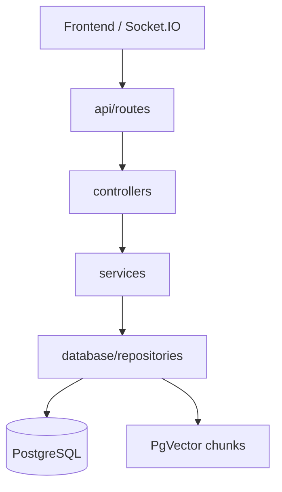
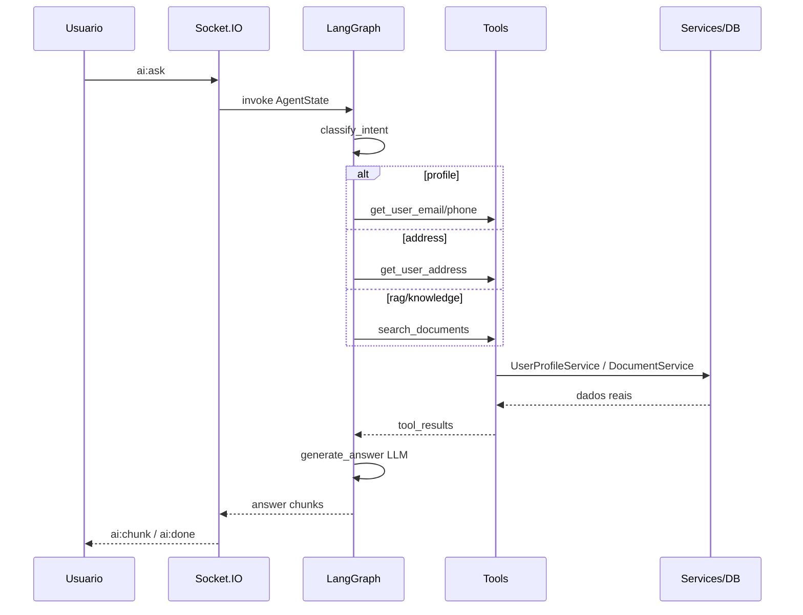

# Arquitetura DocMind — Plataforma de Agentes IA

## Visão geral

O backend segue camadas separadas: **API → Controllers → Services → Repositories → PostgreSQL/PgVector**. Agentes LangGraph nunca acessam o banco diretamente; usam **tools** que delegam aos services.



## Fluxo de uma pergunta no chat



## Roteamento de intenção

| Pergunta exemplo | Intent | Tools | Service | Tabelas |
|------------------|--------|-------|---------|---------|
| Qual meu email? | profile | get_user_email | UserProfileService | user_profiles, users |
| Qual meu telefone? | profile | get_user_phone | UserProfileService | user_profiles |
| Qual meu endereço? | address | get_user_address | UserProfileService | user_profiles |
| Como configurar a operadora? | rag | search_documents | DocumentService | document_chunks, documentos |
| O que diz o manual? | rag | search_documents, get_document_keywords | DocumentService | document_chunks, documentos |

## Central de conhecimento (RAG)

1. Upload PDF em `POST /documents/upload` (JWT).
2. Extração de texto (`rag/loaders/pdf_loader.py`).
3. Metadados via LLM estruturado (`DocumentMetadataService`): título, palavras-chave, resumo, tópicos, entidades.
4. Persistência em `documentos` + arquivo em `DOCUMENTS_STORAGE_DIR`.
5. Chunks + embeddings OpenAI em `document_chunks` (coluna `vector(1536)` + índice HNSW).

Recuperação: `SemanticRetriever` ordena por distância de cosseno (`embedding <=>` no PostgreSQL).

## Por que PgVector

- Mesmo cluster PostgreSQL já usado pela aplicação.
- FK `document_chunks.documento_id → documentos.id` e transações ACID com metadados.
- Sem volume FAISS compartilhado entre API e worker.

## Por que tools não acessam o banco

- **SOLID:** agente orquestra; services encapsulam regras; repositories encapsulam SQL.
- **Testabilidade:** tools mockam services.
- **Anti-alucinação:** prompts exigem usar apenas `tool_results`; profile tools leem só o `user_id` do JWT/state.

## Contrato Socket.IO (inalterado)

- `connect` com `auth: { token }`
- `ai:ask` → `ai:chunk` (delta) → `ai:done` / `ai:error`

Payload compatível com o frontend existente (`question`, `conversation_id`, `images`, `attachment_context`).

## Estrutura de pastas

```
src/
├── api/routes/          # FastAPI routers
├── controllers/         # HTTP → services
├── core/                # config, security, dependencies, exceptions
├── database/            # models, session, repositories
├── services/            # regras de negócio
├── agents/              # LangGraph, tools, prompts, state
├── rag/                 # loaders, splitters, embeddings, retrievers
├── schemas/             # Pydantic DTOs
├── realtime/            # Socket.IO
└── workers/             # Celery
```

## Endpoints principais

| Método | Rota | Auth |
|--------|------|------|
| POST | /documents/upload | Sim |
| GET | /documents/ | Sim |
| DELETE | /documents/{id} | Sim |
| GET/PUT | /profile/me | Sim |
| GET | /profile/cep/{cep} | Sim |
| POST | /agent/ask | Sim |
